# More Images

Table of Content
<!--ts-->
- [More Images](#more-images)
  - [Norm Based Attacks](#norm-based-attacks)
    - [Same Origin vs Different Targets](#same-origin-vs-different-targets)
      - [Loose Layout](#loose-layout)
        - [MNSIT CNN NMN (NBA SOvsDT LL)](#mnsit-cnn-nmn-nba-sovsdt-ll)
        - [MNSIT CNN MND (NBA SOvsDT LL)](#mnsit-cnn-mnd-nba-sovsdt-ll)
        - [MNSIT CAPS NMN (NBA SOvsDT LL)](#mnsit-caps-nmn-nba-sovsdt-ll)
        - [MNSIT CAPS MND (NBA SOvsDT LL)](#mnsit-caps-mnd-nba-sovsdt-ll)
        - [CIFAR10 CNN NMN (NBA SOvsDT LL)](#cifar10-cnn-nmn-nba-sovsdt-ll)
        - [CIFAR10 CNN MND (NBA SOvsDT LL)](#cifar10-cnn-mnd-nba-sovsdt-ll)
        - [CIFAR10 CAPS NMN (NBA SOvsDT LL)](#cifar10-caps-nmn-nba-sovsdt-ll)
        - [CIFAR10 CAPS MND (NBA SOvsDT LL)](#cifar10-caps-mnd-nba-sovsdt-ll)
      - [Tight Layout](#tight-layout)
        - [MNIST CNN NMN (NBA SOvsDT TL)](#mnist-cnn-nmn-nba-sovsdt-tl)
        - [MNIST CNN MND (NBA SOvsDT TL)](#mnist-cnn-mnd-nba-sovsdt-tl)
        - [MNIST CAPS NMN (NBA SOvsDT TL)](#mnist-caps-nmn-nba-sovsdt-tl)
        - [MNIST CAPS MND (NBA SOvsDT TL)](#mnist-caps-mnd-nba-sovsdt-tl)
        - [CIFAR10 CNN NMN (NBA SOvsDT TL)](#cifar10-cnn-nmn-nba-sovsdt-tl)
        - [CIFAR10 CNN MND (NBA SOvsDT TL)](#cifar10-cnn-mnd-nba-sovsdt-tl)
        - [CIFAR10 CAPS NMN (NBA SOvsDT TL)](#cifar10-caps-nmn-nba-sovsdt-tl)
        - [CIFAR10 CAPS MND (NBA SOvsDT TL)](#cifar10-caps-mnd-nba-sovsdt-tl)
    - [Different Origins vs Same Target](#different-origins-vs-same-target)
      - [Loose Layout](#loose-layout-1)
        - [MNSIT CNN NMN (NBA DOvsST LL)](#mnsit-cnn-nmn-nba-dovsst-ll)
        - [MNSIT CNN MND (NBA DOvsST LL)](#mnsit-cnn-mnd-nba-dovsst-ll)
        - [MNSIT CAPS NMN (NBA DOvsST LL)](#mnsit-caps-nmn-nba-dovsst-ll)
        - [MNSIT CAPS MND (NBA DOvsST LL)](#mnsit-caps-mnd-nba-dovsst-ll)
        - [CIFAR10 CNN NMN (NBA DOvsST LL)](#cifar10-cnn-nmn-nba-dovsst-ll)
        - [CIFAR10 CNN MND (NBA DOvsST LL)](#cifar10-cnn-mnd-nba-dovsst-ll)
        - [CIFAR10 CAPS NMN (NBA DOvsST LL)](#cifar10-caps-nmn-nba-dovsst-ll)
        - [CIFAR10 CAPS MND (NBA DOvsST LL)](#cifar10-caps-mnd-nba-dovsst-ll)
      - [Tight Layout](#tight-layout-1)
        - [MNIST CNN NMN (NBA DOvsST TL)](#mnist-cnn-nmn-nba-dovsst-tl)
        - [MNIST CNN MND (NBA DOvsST TL)](#mnist-cnn-mnd-nba-dovsst-tl)
        - [MNIST CAPS NMN (NBA DOvsST TL)](#mnist-caps-nmn-nba-dovsst-tl)
        - [MNIST CAPS MND (NBA DOvsST TL)](#mnist-caps-mnd-nba-dovsst-tl)
        - [CIFAR10 CNN NMN (NBA DOvsST TL)](#cifar10-cnn-nmn-nba-dovsst-tl)
        - [CIFAR10 CNN MND (NBA DOvsST TL)](#cifar10-cnn-mnd-nba-dovsst-tl)
        - [CIFAR10 CAPS NMN (NBA DOvsST TL)](#cifar10-caps-nmn-nba-dovsst-tl)
        - [CIFAR10 CAPS MND (NBA DOvsST TL)](#cifar10-caps-mnd-nba-dovsst-tl)
  - [Dimension Based Attacks](#dimension-based-attacks)
    - [Loose Layout](#loose-layout-2)
      - [MNIST CAPS NMCD (DBA LL)](#mnist-caps-nmcd-dba-ll)
      - [MNIST CAPS MCDD (DBA LL)](#mnist-caps-mcdd-dba-ll)
      - [CIFAR10 CAPS NMCD (DBA LL)](#cifar10-caps-nmcd-dba-ll)
      - [CIFAR10 CAPS MCDD (DBA LL)](#cifar10-caps-mcdd-dba-ll)
    - [Tight Layout](#tight-layout-2)
      - [MNIST CAPS NMCD (DBA TL)](#mnist-caps-nmcd-dba-tl)
      - [MNIST CAPS MCDD (DBA TL)](#mnist-caps-mcdd-dba-tl)
      - [CIFAR10 CAPS NMCD (DBA TL)](#cifar10-caps-nmcd-dba-tl)
      - [CIFAR10 CAPS MCDD (DBA TL)](#cifar10-caps-mcdd-dba-tl)
<!--te-->

## Norm Based Attacks
### Same Origin vs Different Targets
#### Loose Layout
##### MNSIT CNN NMN (NBA SOvsDT LL)

[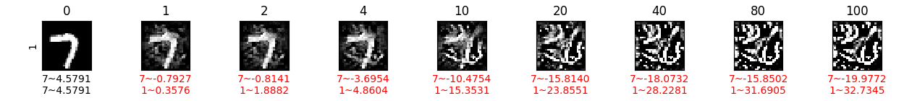](#norm-based-attacks)

[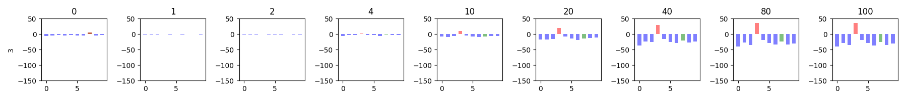](#norm-based-attacks)

[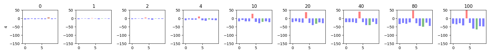](#norm-based-attacks)

[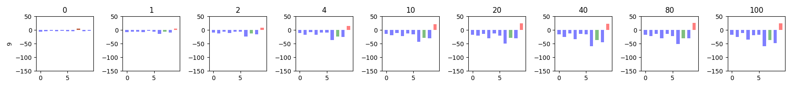](#norm-based-attacks)

##### MNSIT CNN MND (NBA SOvsDT LL)
[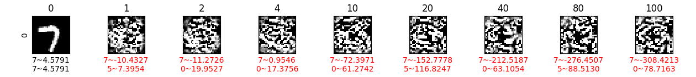](#norm-based-attacks)

[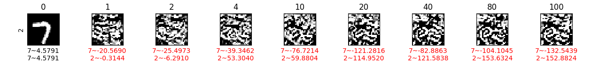](#norm-based-attacks)
[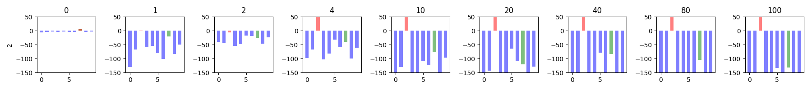](#norm-based-attacks)
[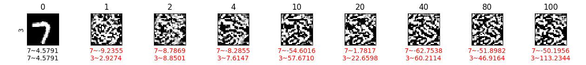](#norm-based-attacks)

[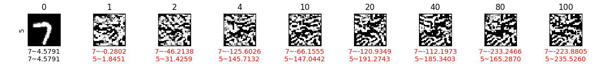](#norm-based-attacks)

[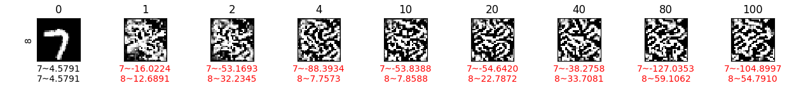](#norm-based-attacks)

[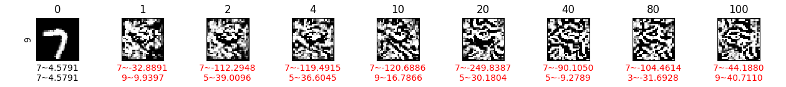](#norm-based-attacks)

##### MNSIT CAPS NMN (NBA SOvsDT LL)
[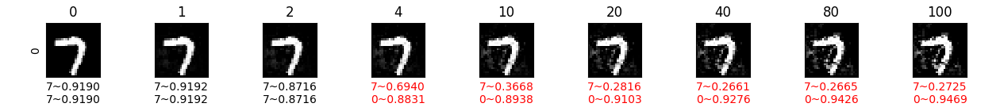](#norm-based-attacks)
[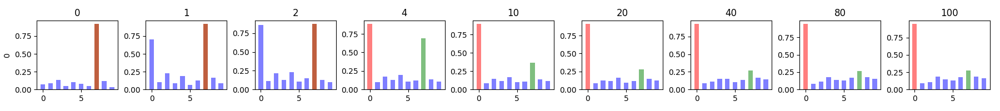](#norm-based-attacks)

[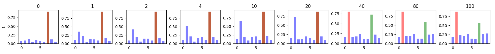](#norm-based-attacks)
[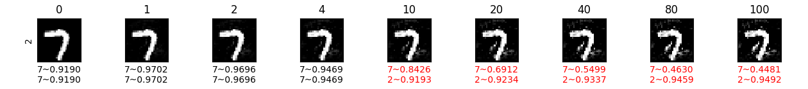](#norm-based-attacks)

[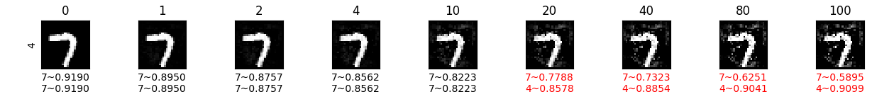](#norm-based-attacks)

[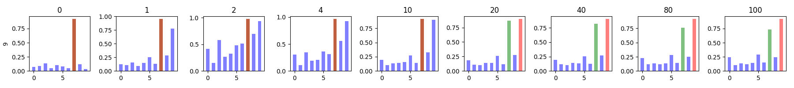](#norm-based-attacks)

##### MNSIT CAPS MND (NBA SOvsDT LL)

[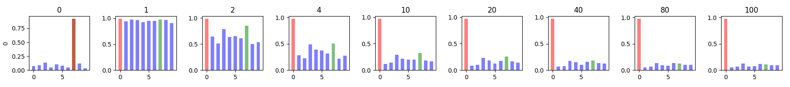](#norm-based-attacks)
[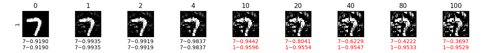](#norm-based-attacks)

[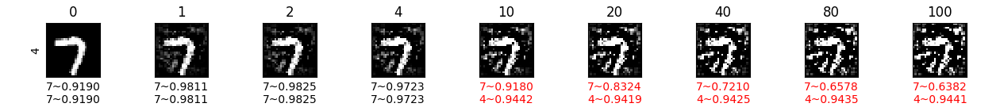](#norm-based-attacks)

[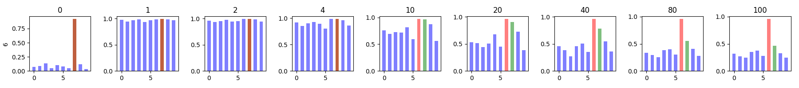](#norm-based-attacks)

[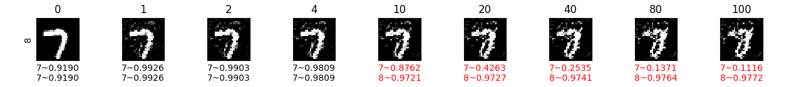](#norm-based-attacks)

[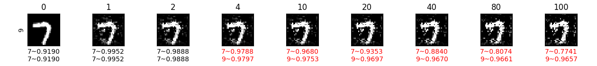](#norm-based-attacks)
[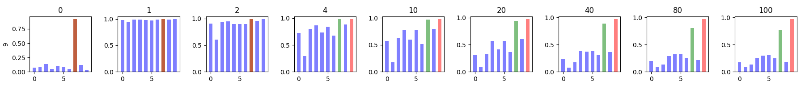](#norm-based-attacks)

---
##### CIFAR10 CNN NMN (NBA SOvsDT LL)

[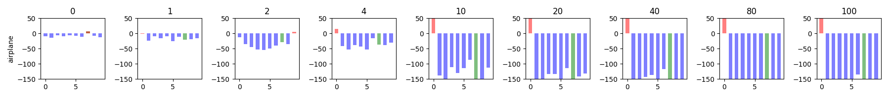](#norm-based-attacks)
[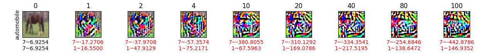](#norm-based-attacks)

[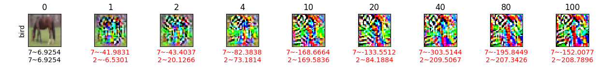](#norm-based-attacks)
[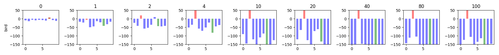](#norm-based-attacks)

[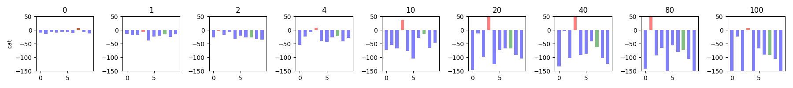](#norm-based-attacks)
[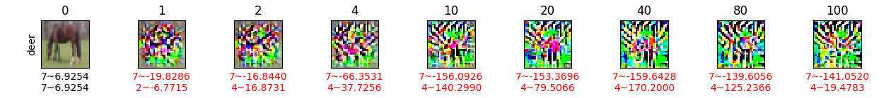](#norm-based-attacks)

[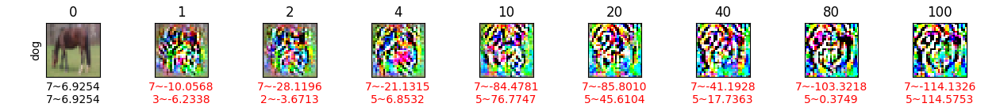](#norm-based-attacks)

[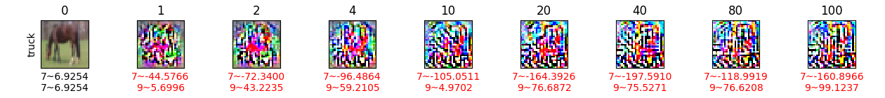](#norm-based-attacks)
[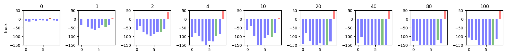](#norm-based-attacks)

##### CIFAR10 CNN MND (NBA SOvsDT LL)
[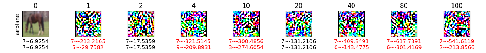](#norm-based-attacks)

[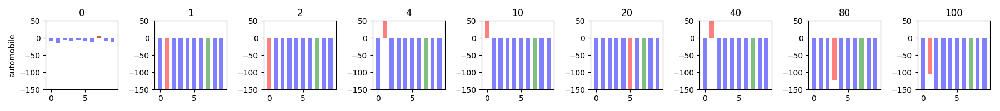](#norm-based-attacks)
[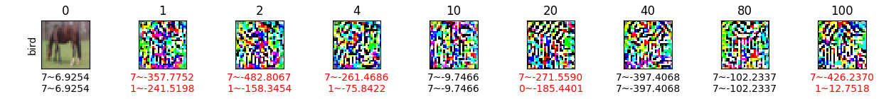](#norm-based-attacks)
[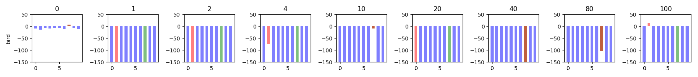](#norm-based-attacks)

[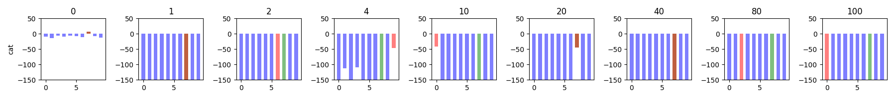](#norm-based-attacks)

[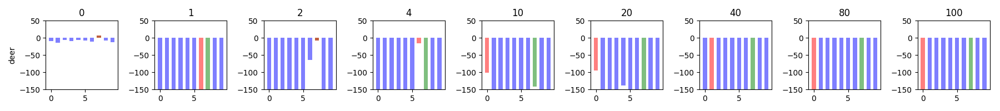](#norm-based-attacks)

[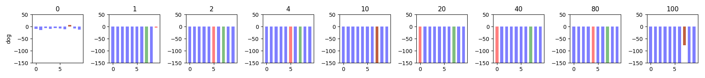](#norm-based-attacks)

[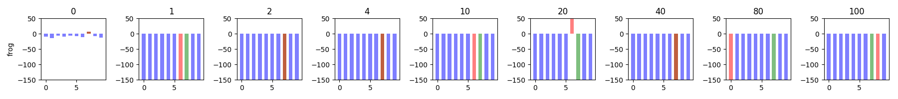](#norm-based-attacks)

[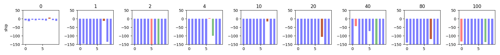](#norm-based-attacks)

##### CIFAR10 CAPS NMN (NBA SOvsDT LL)
[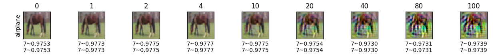](#norm-based-attacks)
[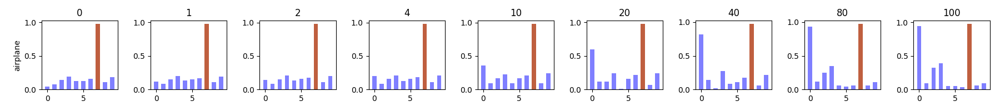](#norm-based-attacks)

[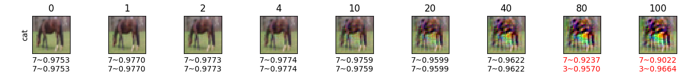](#norm-based-attacks)
[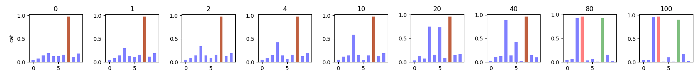](#norm-based-attacks)

[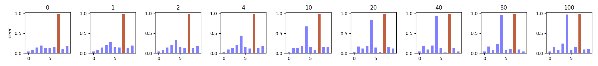](#norm-based-attacks)
[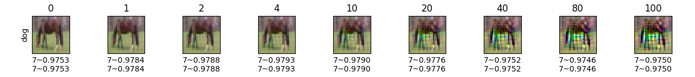](#norm-based-attacks)
[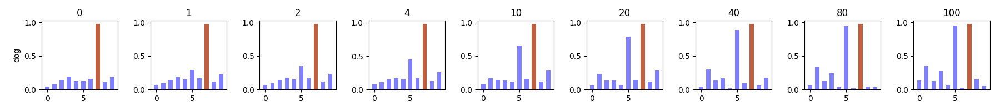](#norm-based-attacks)

[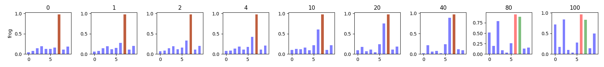](#norm-based-attacks)

##### CIFAR10 CAPS MND (NBA SOvsDT LL)

#### Tight Layout
##### MNIST CNN NMN (NBA SOvsDT TL)

##### MNIST CNN MND (NBA SOvsDT TL)

##### MNIST CAPS NMN (NBA SOvsDT TL)

##### MNIST CAPS MND (NBA SOvsDT TL)

---
##### CIFAR10 CNN NMN (NBA SOvsDT TL)

##### CIFAR10 CNN MND (NBA SOvsDT TL)

##### CIFAR10 CAPS NMN (NBA SOvsDT TL)

##### CIFAR10 CAPS MND (NBA SOvsDT TL)

### Different Origins vs Same Target
#### Loose Layout
##### MNSIT CNN NMN (NBA DOvsST LL)

##### MNSIT CNN MND (NBA DOvsST LL)

##### MNSIT CAPS NMN (NBA DOvsST LL)

##### MNSIT CAPS MND (NBA DOvsST LL)

---
##### CIFAR10 CNN NMN (NBA DOvsST LL)

##### CIFAR10 CNN MND (NBA DOvsST LL)

##### CIFAR10 CAPS NMN (NBA DOvsST LL)

##### CIFAR10 CAPS MND (NBA DOvsST LL)

#### Tight Layout
##### MNIST CNN NMN (NBA DOvsST TL)

##### MNIST CNN MND (NBA DOvsST TL)

##### MNIST CAPS NMN (NBA DOvsST TL)

##### MNIST CAPS MND (NBA DOvsST TL)

---
##### CIFAR10 CNN NMN (NBA DOvsST TL)

##### CIFAR10 CNN MND (NBA DOvsST TL)

##### CIFAR10 CAPS NMN (NBA DOvsST TL)

##### CIFAR10 CAPS MND (NBA DOvsST TL)

## Dimension Based Attacks
### Loose Layout
#### MNIST CAPS NMCD (DBA LL)

#### MNIST CAPS MCDD (DBA LL)

#### CIFAR10 CAPS NMCD (DBA LL)

#### CIFAR10 CAPS MCDD (DBA LL)

### Tight Layout
#### MNIST CAPS NMCD (DBA TL)

#### MNIST CAPS MCDD (DBA TL)

#### CIFAR10 CAPS NMCD (DBA TL)

#### CIFAR10 CAPS MCDD (DBA TL)

