# Capsule Specific Attack Visualization Analysis
In capsule-specific attacks, we retrained a _CNN_ model and a full _CapsNet_
with sub-network on MNIST and CIFAR10 for 500 epochs. There were no data
deformations applied except some cropping operations in this set of experiments.
For MNIST, the image size is 28 $\times$ 28. For CIFAR10, the image size is
cropped to 28 $\times$ 28 $\times$ 3 (random cropping for training set and
central cropping for test set).

In this file, we include two types of layouts, **Loose Layout** and
**Tight Layout**, for possible combinations of different **dataset**, 
**model type**, and **attack methods**. For detailed image-distribution
visualizations, refer to **Loose Layout** sections. For quick overview of
visualizations, navigate to **Tight Layout** sections.

To keep visualizations of different methods comparable, the following discussions all use the same instance number and capsule selection settings (instance_num=3, cap_idx=7), that means, the figures you see below are mostly using the same original images. 

## Abbreviations

### Methods
#### Norm Based
- **NMN**: Naively maximizing target capsule's norm.
- **MND**: Maximizing the difference between target capsule's norm and the rest capsules' norm.
#### Dimension Based
- **NMCD**: Naively maximizing a dimension of the target capsule.
- **MCDD**: Maximizing the different between a dimension and the rest dimensions of the target capsule.

### Comparison Types
- **Same Origins vs Different Targets**: we use the same original image as the base image, then set different capsules as target class to push the base image into different target classes.
- **Different Origins vs Same Target**: we use different images as base images, then set a same capsule as target class to push the different base images into the same target class.

Table of Content
<!--ts-->
- [Capsule Specific Attack Visualization Analysis](#capsule-specific-attack-visualization-analysis)
  - [Abbreviations](#abbreviations)
    - [Methods](#methods)
      - [Norm Based](#norm-based)
      - [Dimension Based](#dimension-based)
    - [Comparison Types](#comparison-types)
  - [Norm Based Attacks](#norm-based-attacks)
  - 
  - 
    - [Same Origin vs Different Targets](#same-origin-vs-different-targets)
      - [Loose Layout](#loose-layout)
        - [MNSIT CNN NMN (NBA SOvsDT LL)](#mnsit-cnn-nmn-nba-sovsdt-ll)
        - [MNSIT CNN MND (NBA SOvsDT LL)](#mnsit-cnn-mnd-nba-sovsdt-ll)
        - [MNSIT CAPS NMN (NBA SOvsDT LL)](#mnsit-caps-nmn-nba-sovsdt-ll)
        - [MNSIT CAPS MND (NBA SOvsDT LL)](#mnsit-caps-mnd-nba-sovsdt-ll)
      - [Tight Layout](#tight-layout)
        - [MNIST CNN NMN (NBA SOvsDT TL)](#mnist-cnn-nmn-nba-sovsdt-tl)
        - [MNIST CNN MND (NBA SOvsDT TL)](#mnist-cnn-mnd-nba-sovsdt-tl)
        - [MNIST CAPS NMN (NBA SOvsDT TL)](#mnist-caps-nmn-nba-sovsdt-tl)
        - [MNIST CAPS MND (NBA SOvsDT TL)](#mnist-caps-mnd-nba-sovsdt-tl)
        - [CIFAR10 CNN NMN (NBA SOvsDT TL)](#cifar10-cnn-nmn-nba-sovsdt-tl)
        - [CIFAR10 CNN MND (NBA SOvsDT TL)](#cifar10-cnn-mnd-nba-sovsdt-tl)
        - [CIFAR10 CAPS NMN (NBA SOvsDT TL)](#cifar10-caps-nmn-nba-sovsdt-tl)
        - [CIFAR10 CAPS MND (NBA SOvsDT TL)](#cifar10-caps-mnd-nba-sovsdt-tl)
    - [Different Origins vs Same Target](#different-origins-vs-same-target)
      - [Loose Layout](#loose-layout-1)
        - [MNSIT CNN NMN (NBA DOvsST LL)](#mnsit-cnn-nmn-nba-dovsst-ll)
        - [MNSIT CNN MND (NBA DOvsST LL)](#mnsit-cnn-mnd-nba-dovsst-ll)
        - [MNSIT CAPS NMN (NBA DOvsST LL)](#mnsit-caps-nmn-nba-dovsst-ll)
        - [MNSIT CAPS MND (NBA DOvsST LL)](#mnsit-caps-mnd-nba-dovsst-ll)
      - [Tight Layout](#tight-layout-1)
        - [MNIST CNN NMN (NBA DOvsST TL)](#mnist-cnn-nmn-nba-dovsst-tl)
        - [MNIST CNN MND (NBA DOvsST TL)](#mnist-cnn-mnd-nba-dovsst-tl)
        - [MNIST CAPS NMN (NBA DOvsST TL)](#mnist-caps-nmn-nba-dovsst-tl)
        - [MNIST CAPS MND (NBA DOvsST TL)](#mnist-caps-mnd-nba-dovsst-tl)
        - [CIFAR10 CNN NMN (NBA DOvsST TL)](#cifar10-cnn-nmn-nba-dovsst-tl)
        - [CIFAR10 CNN MND (NBA DOvsST TL)](#cifar10-cnn-mnd-nba-dovsst-tl)
        - [CIFAR10 CAPS NMN (NBA DOvsST TL)](#cifar10-caps-nmn-nba-dovsst-tl)
        - [CIFAR10 CAPS MND (NBA DOvsST TL)](#cifar10-caps-mnd-nba-dovsst-tl)
  - [Dimension Based Attacks](#dimension-based-attacks)
    - [Loose Layout](#loose-layout-2)
      - [MNIST CAPS NMCD (DBA LL)](#mnist-caps-nmcd-dba-ll)
      - [MNIST CAPS MCDD (DBA LL)](#mnist-caps-mcdd-dba-ll)
    - [Tight Layout](#tight-layout-2)
      - [MNIST CAPS NMCD (DBA TL)](#mnist-caps-nmcd-dba-tl)
      - [MNIST CAPS MCDD (DBA TL)](#mnist-caps-mcdd-dba-tl)
      - [CIFAR10 CAPS NMCD (DBA TL)](#cifar10-caps-nmcd-dba-tl)
      - [CIFAR10 CAPS MCDD (DBA TL)](#cifar10-caps-mcdd-dba-tl)
  - [Method Wise Comparison](#method-wise-comparison)
    - [MNIST CAPS (MWC)](#mnist-caps-mwc)
    - [CIFAR10 CAPS (MWC)](#cifar10-caps-mwc)
<!--te-->

---
**NOTE**: we seperated out **Loose Layout** visualizations of CIFAR10 in [More-Images.md](More-Images.md)
to keep this file as neat and general as possible.

**A Convenient Tip to Navigate between Sections**: In order to easily navigate between discussions
and corresponding visualizations, I added _hyperlink_ to figures so that readers can easily
click back to the discussion at the beginning of the section.

E.g., readers can click any figures under [Norm Based Attacks](#norm-based-attacks) and the web
browser will automatically reset page to the corresponding section discussion.

---

## Norm Based Attacks
Intuition on difference between _CNNs_ and _CapsNets_. Because the nature of norm based attacks, which
takes advantages of norms of vectors, one can also apply the same methods to _CNNs_ by directly
using the scalar values as ''norms'' (though here these ''norms'' can be negative, it doesn't
affect the gradient computation). The results shed light on how _CNNs_ and _CapsNets_ are
structurally different from each other. In Figures below,

---
Collection 1
Original Class = 7, Target Class = 2
- CNN NMN: 
[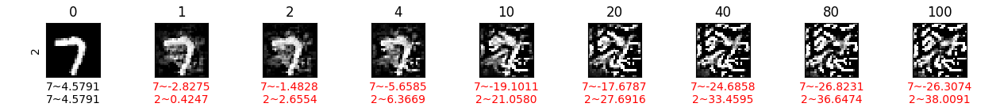](#norm-based-attacks)
- CNN MND: 
[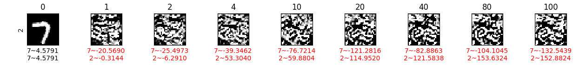](#norm-based-attacks)
- Caps NMN: 
[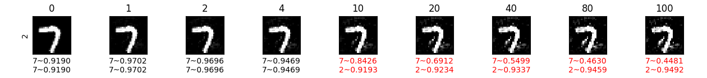](#norm-based-attacks)
- Caps MND: 
[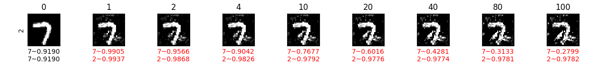](#norm-based-attacks)
---
it is not hard to observe that the results from _CNNs_ are much noiser than those from _CapsNets_,
which can partially result from the fact we did not adjust the step size for _CNNs_.
Nevertheless, we can observe that the learned 'features' are eventually added to the whole
region of the image in _CNN_ models, as shown in Figure (CNN NMN) and Figure (CNN MND).
While on results from _CapsNets_ (Figure (Caps NMN) and Figure (Caps MND) in Collection 1), new 'features' are
added in the vicinity of original strong 'features', e.g. tilted vertical line of this given
digit '7'. Why there is such difference? As mentioned earlier, the accumulated perturbation
that results from step size and number of iteration settings of adversarial perturbation
could result in this difference. For images in Figure (Caps NMN) and Figure (Caps MND) in Collection 1, if
kept applying a sufficiently large number of iterations, the white noise (or added 'features')
might eventually cover the whole region as well such as examples in Figure (Caps MND) in Collection 2.

We notice that white noise from _CNNs_ are more adhesive to each other, while those
from _Caps_ are relatively independent to each other. Therefore, we also believe the part-whole agreement of _CapsNets_ plays a substantial role here. _CapsNets_ are also applied with a variation of
convolutional operation --- capsule
convolution (as introduced in the original paper). Hence, while processing pixel intensity
values into probabilities of classes, both _CNNs_ and _CapsNets_ use shared kernels/capsule
kernels to slide through every fixed size subregion to detect features, by which they achieve
translational-equivariance. When generating adversarial examples, translational-equivariance
helps _CNNs_ send feedbacks no matter what feature it detected. But for _CapsNets_, those
feedbacks are further verified by the part-whole agreement mechanism, e.g. if a potential low
activity of feature 'A' (that belongs to object 'O') is detected a location, but 'A''s location
does not likely satisfy the part-whole agreement between 'A' and 'O', then its gradient signal
will be filtered out by the agreement mechnism.

---
Collection 2
Original Class = 7, Target Class = 0 ~ 9 (each row is targeting one class)
- CNN NMN:
  [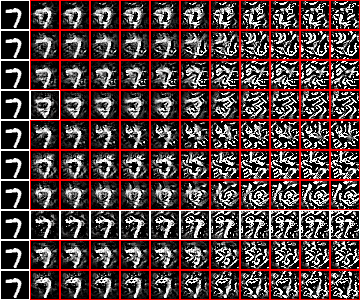](#norm-based-attacks)
- CNN MND
  [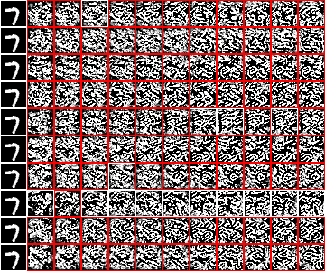](#norm-based-attacks)
- Caps NMN
  [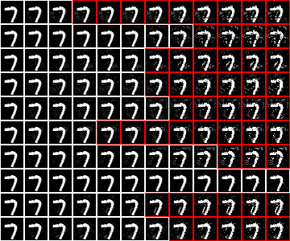](#norm-based-attacks)
- Caps MND
  [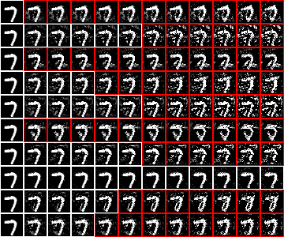](#norm-based-attacks)
---

### Same Origin vs Different Targets
#### Loose Layout
##### MNSIT CNN NMN (NBA SOvsDT LL)
[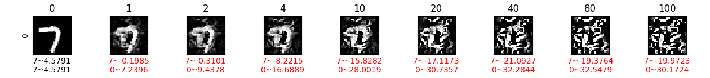](#norm-based-attacks)
[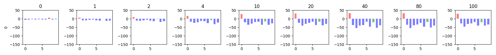](#norm-based-attacks)
[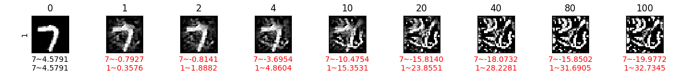](#norm-based-attacks)
[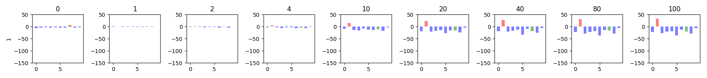](#norm-based-attacks)

[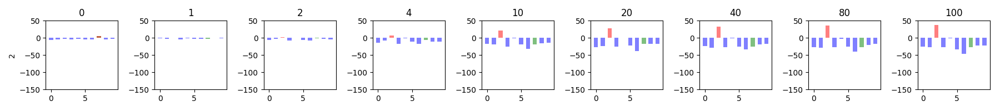](#norm-based-attacks)
[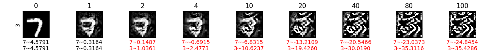](#norm-based-attacks)
[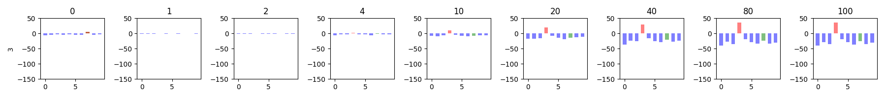](#norm-based-attacks)
[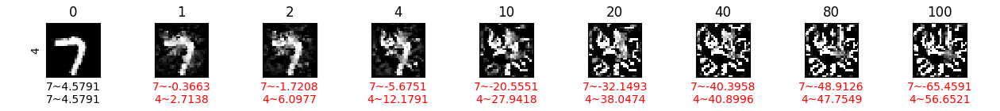](#norm-based-attacks)
[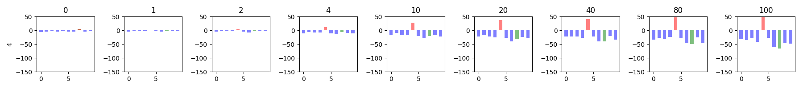](#norm-based-attacks)
[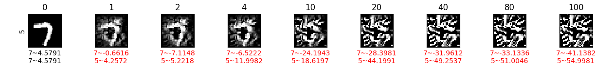](#norm-based-attacks)
[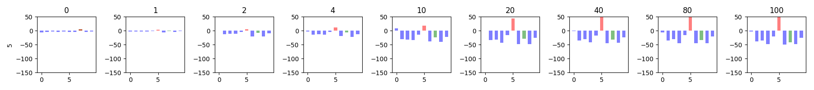](#norm-based-attacks)
[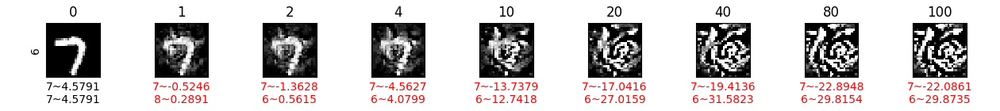](#norm-based-attacks)

[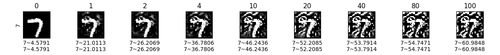](#norm-based-attacks)
[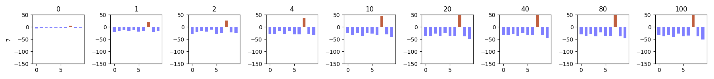](#norm-based-attacks)
[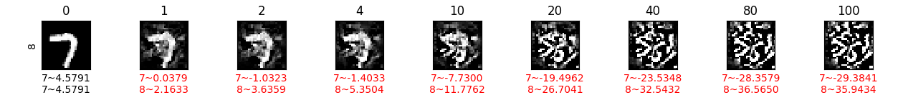](#norm-based-attacks)
[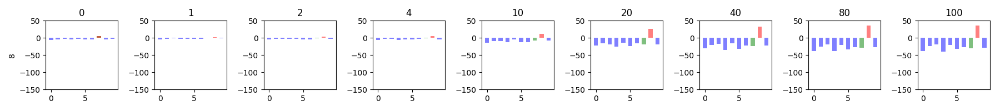](#norm-based-attacks)
[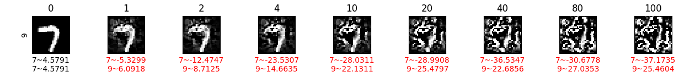](#norm-based-attacks)
[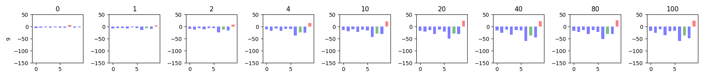](#norm-based-attacks)

##### MNSIT CNN MND (NBA SOvsDT LL)
[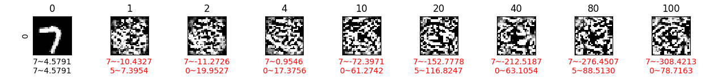](#norm-based-attacks)
[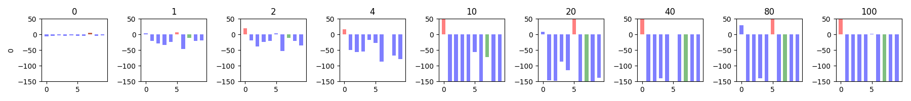](#norm-based-attacks)
[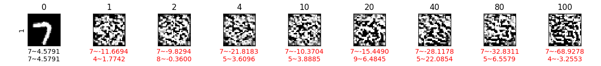](#norm-based-attacks)
[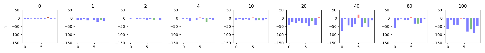](#norm-based-attacks)

[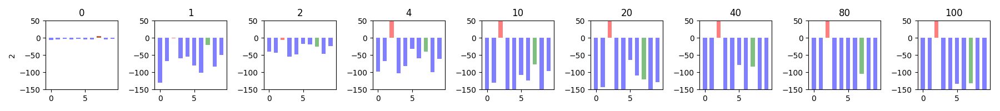](#norm-based-attacks)
[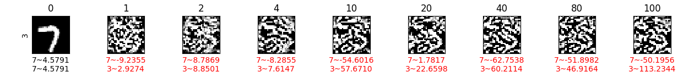](#norm-based-attacks)
[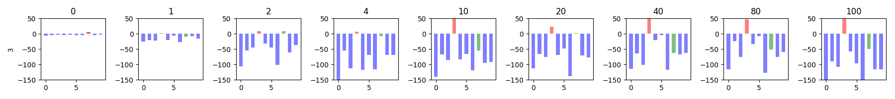](#norm-based-attacks)
[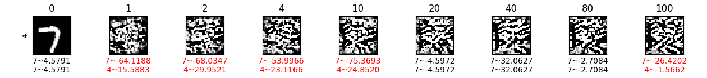](#norm-based-attacks)
[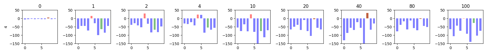](#norm-based-attacks)
[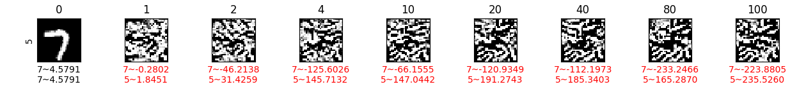](#norm-based-attacks)
[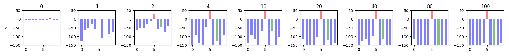](#norm-based-attacks)
[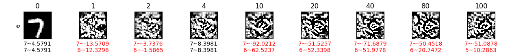](#norm-based-attacks)
[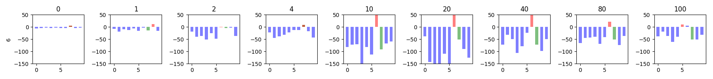](#norm-based-attacks)
[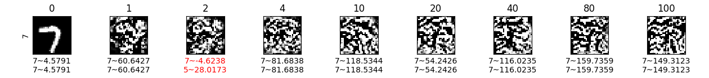](#norm-based-attacks)
[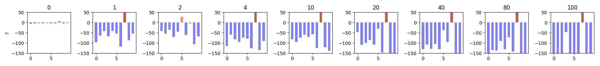](#norm-based-attacks)
[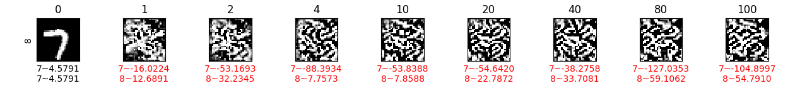](#norm-based-attacks)
[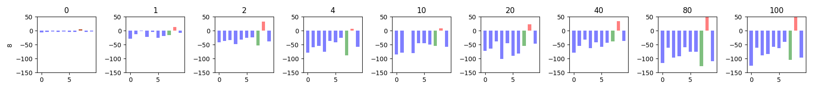](#norm-based-attacks)
[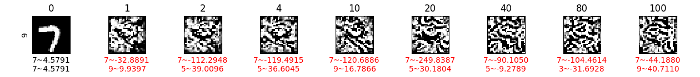](#norm-based-attacks)
[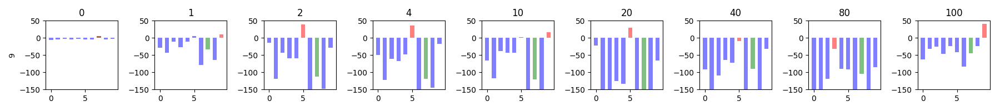](#norm-based-attacks)

##### MNSIT CAPS NMN (NBA SOvsDT LL)
[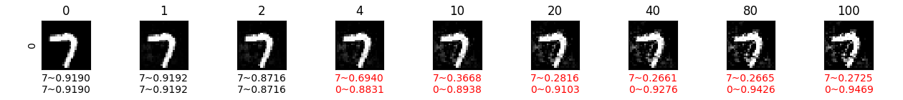](#norm-based-attacks)
[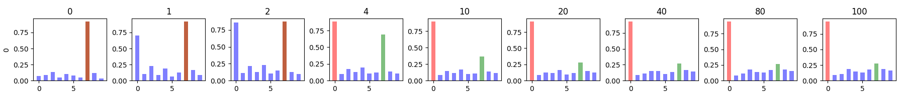](#norm-based-attacks)
[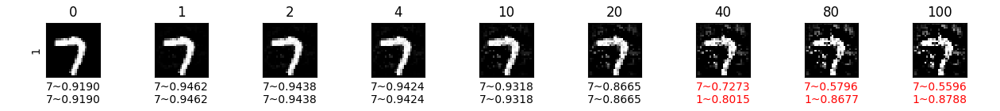](#norm-based-attacks)
[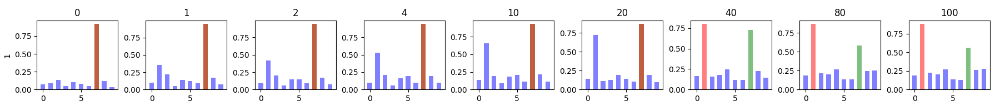](#norm-based-attacks)

[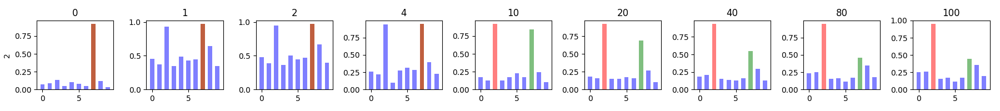](#norm-based-attacks)

##### MNSIT CAPS MND (NBA SOvsDT LL)

#### Tight Layout
##### MNIST CNN NMN (NBA SOvsDT TL)

##### MNIST CNN MND (NBA SOvsDT TL)

##### MNIST CAPS NMN (NBA SOvsDT TL)

##### MNIST CAPS MND (NBA SOvsDT TL)

---
##### CIFAR10 CNN NMN (NBA SOvsDT TL)

##### CIFAR10 CNN MND (NBA SOvsDT TL)

##### CIFAR10 CAPS NMN (NBA SOvsDT TL)

##### CIFAR10 CAPS MND (NBA SOvsDT TL)

### Different Origins vs Same Target
#### Loose Layout
##### MNSIT CNN NMN (NBA DOvsST LL)

##### MNSIT CNN MND (NBA DOvsST LL)

##### MNSIT CAPS NMN (NBA DOvsST LL)

##### MNSIT CAPS MND (NBA DOvsST LL)

#### Tight Layout
##### MNIST CNN NMN (NBA DOvsST TL)

##### MNIST CNN MND (NBA DOvsST TL)

##### MNIST CAPS NMN (NBA DOvsST TL)

##### MNIST CAPS MND (NBA DOvsST TL)

---
##### CIFAR10 CNN NMN (NBA DOvsST TL)

##### CIFAR10 CNN MND (NBA DOvsST TL)

##### CIFAR10 CAPS NMN (NBA DOvsST TL)

##### CIFAR10 CAPS MND (NBA DOvsST TL)

## Dimension Based Attacks
### Loose Layout
#### MNIST CAPS NMCD (DBA LL)

#### MNIST CAPS MCDD (DBA LL)

### Tight Layout
#### MNIST CAPS NMCD (DBA TL)

#### MNIST CAPS MCDD (DBA TL)

#### CIFAR10 CAPS NMCD (DBA TL)

#### CIFAR10 CAPS MCDD (DBA TL)

## Method Wise Comparison

### MNIST CAPS (MWC)
- NMN: 
- MND: 
- NMCD: 
- MCDD: 

### CIFAR10 CAPS (MWC)
- NMN: 
- MND: 
- NMCD: 
- MCDD: 