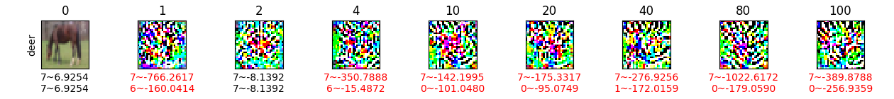
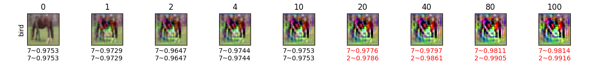
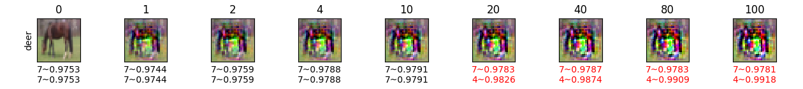
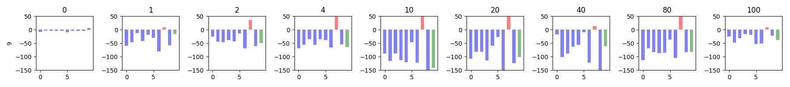
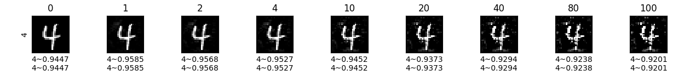
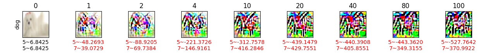
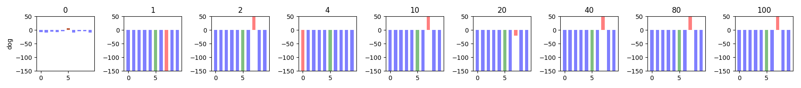
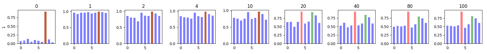

# Capsule Specific Attack Visualization Analysis

_For quick overview of visualizations, navigate to **Tight Layout** sections._

Table of Content
<!--ts-->
- [Capsule Specific Attack Visualization Analysis](#capsule-specific-attack-visualization-analysis)
  - [Abbreviations](#abbreviations)
  - [Norm Based Attacks](#norm-based-attacks)
    - [Same Origin vs Different Targets](#same-origin-vs-different-targets)
      - [Loose Layout](#loose-layout)
        - [MNSIT CNN NMN](#mnsit-cnn-nmn)
        - [MNSIT CNN MND](#mnsit-cnn-mnd)
        - [MNSIT CAPS NMN](#mnsit-caps-nmn)
        - [MNSIT CNN NMN](#mnsit-cnn-nmn-1)
        - [CIFAR10 CNN NMN](#cifar10-cnn-nmn)
        - [CIFAR10 CNN MND](#cifar10-cnn-mnd)
        - [CIFAR10 CAPS NMN](#cifar10-caps-nmn)
        - [CIFAR10 CAPS NMN](#cifar10-caps-nmn-1)
      - [Tight Layout](#tight-layout)
        - [MNIST CNN NMN](#mnist-cnn-nmn)
        - [MNIST CNN MND](#mnist-cnn-mnd)
        - [MNIST CAPS NMN](#mnist-caps-nmn)
        - [MNIST CAPS MND](#mnist-caps-mnd)
        - [CIFAR10 CNN NMN](#cifar10-cnn-nmn-1)
        - [CIFAR10 CNN MND](#cifar10-cnn-mnd-1)
        - [CIFAR10 CAPS NMN](#cifar10-caps-nmn-2)
        - [CIFAR10 CAPS MND](#cifar10-caps-mnd)
    - [Different Origins vs Same Target](#different-origins-vs-same-target)
      - [Loose Layout](#loose-layout-1)
        - [MNSIT CNN NMN](#mnsit-cnn-nmn-2)
        - [MNSIT CNN MND](#mnsit-cnn-mnd-1)
        - [MNSIT CAPS NMN](#mnsit-caps-nmn-1)
        - [MNSIT CNN NMN](#mnsit-cnn-nmn-3)
        - [CIFAR10 CNN NMN](#cifar10-cnn-nmn-2)
        - [CIFAR10 CNN MND](#cifar10-cnn-mnd-2)
        - [CIFAR10 CAPS NMN](#cifar10-caps-nmn-3)
        - [CIFAR10 CAPS NMN](#cifar10-caps-nmn-4)
      - [Tight Layout](#tight-layout-1)
        - [MNIST CNN NMN](#mnist-cnn-nmn-1)
        - [MNIST CNN MND](#mnist-cnn-mnd-1)
        - [MNIST CAPS NMN](#mnist-caps-nmn-1)
        - [MNIST CAPS MND](#mnist-caps-mnd-1)
        - [CIFAR10 CNN NMN](#cifar10-cnn-nmn-3)
        - [CIFAR10 CNN MND](#cifar10-cnn-mnd-3)
        - [CIFAR10 CAPS NMN](#cifar10-caps-nmn-5)
        - [CIFAR10 CAPS MND](#cifar10-caps-mnd-1)
  - [Dimension Based Attacks](#dimension-based-attacks)
    - [Loose Layout](#loose-layout-2)
      - [MNIST CAPS NMCD](#mnist-caps-nmcd)
      - [MNIST CAPS MCDD](#mnist-caps-mcdd)
      - [CIFAR10 CAPS NMCD](#cifar10-caps-nmcd)
      - [CIFAR10 CAPS NMCD](#cifar10-caps-nmcd-1)
    - [Tight Layout](#tight-layout-2)
      - [MNIST CAPS NMCD](#mnist-caps-nmcd-1)
      - [MNIST CAPS MCDD](#mnist-caps-mcdd-1)
      - [CIFAR10 CAPS NMCD](#cifar10-caps-nmcd-2)
      - [CIFAR10 CAPS MCDD](#cifar10-caps-mcdd)
  - [Method Wise Comparison](#method-wise-comparison)
    - [MNIST CAPS](#mnist-caps)
    - [CIFAR10 CAPS](#cifar10-caps)
<!--te-->

<aside class="notice">
To keep visualizations of different methods comparable, the following discussions all use the same instance number and capsule selection settings (instance_num=3, cap_idx=7), that means, the figures you see below are mostly using the same original images. 
</aside>

## Abbreviations
- **NMN**: Naively maximizing target capsule's norm.
- **MND**: Maximizing the difference between target capsule's norm and the rest capsules' norm.
- **NMCD**: Naively maximizing a dimension of the target capsule.
- **MCDD**: Maximizing the different between a dimension and the rest dimensions of the target capsule.

## Norm Based Attacks

- **Same Origins vs Different Targets**: we use the same original image as the base image, then set different capsules as target class to push the base image into different target classes.
- **Different Origins vs Same Target**: we use different images as base images, then set a same capsule as target class to push the different base images into the same target class.

### Same Origin vs Different Targets
#### Loose Layout
##### MNSIT CNN NMN

##### MNSIT CNN MND

##### MNSIT CAPS NMN

##### MNSIT CNN NMN

---
##### CIFAR10 CNN NMN

##### CIFAR10 CNN MND

##### CIFAR10 CAPS NMN

##### CIFAR10 CAPS NMN

#### Tight Layout
##### MNIST CNN NMN

##### MNIST CNN MND

##### MNIST CAPS NMN

##### MNIST CAPS MND

---
##### CIFAR10 CNN NMN

##### CIFAR10 CNN MND

##### CIFAR10 CAPS NMN

##### CIFAR10 CAPS MND

### Different Origins vs Same Target
#### Loose Layout
##### MNSIT CNN NMN

##### MNSIT CNN MND

##### MNSIT CAPS NMN

##### MNSIT CNN NMN

---
##### CIFAR10 CNN NMN

##### CIFAR10 CNN MND

##### CIFAR10 CAPS NMN

##### CIFAR10 CAPS NMN

#### Tight Layout
##### MNIST CNN NMN

##### MNIST CNN MND

##### MNIST CAPS NMN

##### MNIST CAPS MND

---
##### CIFAR10 CNN NMN

##### CIFAR10 CNN MND

##### CIFAR10 CAPS NMN

##### CIFAR10 CAPS MND

## Dimension Based Attacks
### Loose Layout
#### MNIST CAPS NMCD

#### MNIST CAPS MCDD

#### CIFAR10 CAPS NMCD

#### CIFAR10 CAPS NMCD

### Tight Layout
#### MNIST CAPS NMCD

#### MNIST CAPS MCDD

#### CIFAR10 CAPS NMCD

#### CIFAR10 CAPS MCDD

## Method Wise Comparison

### MNIST CAPS
- NMN: 
- MND: 
- NMCD: 
- MCDD: 

### CIFAR10 CAPS
- NMN: 
- MND: 
- NMCD: 
- MCDD: 